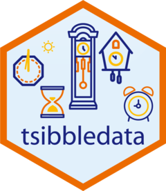

<!-- README.md is generated from README.Rmd. Please edit that file -->

# tsibbledata <a href='https://tsibbledata.tidyverts.org'></a>

<!-- badges: start -->

[](https://github.com/tidyverts/tsibbledata/actions)
[](https://cran.r-project.org/package=tsibbledata)
[](https://lifecycle.r-lib.org/articles/stages.html#stable)
[](https://github.com/tidyverts/tsibbledata/actions/workflows/R-CMD-check.yaml)
<!-- badges: end -->

This package provides examples of
[tsibble](https://tsibble.tidyverts.org/) datasets which can be used
within the [tidyverts](https://tidyverts.org/) family of packages.

## Installation

You could install the stable version on
[CRAN](https://cran.r-project.org/package=tsibbledata):

``` r
install.packages("tsibbledata")
```

You could install the development version from
[GitHub](https://github.com/) using

``` r
# install.packages("remotes")
remotes::install_github("tidyverts/tsibbledata")
```

## Example

``` r
library(tsibbledata)
library(ggplot2)
ggplot(olympic_running, aes(x=Year, y = Time, colour = Sex)) +
  geom_line() +
  geom_point(size = 1) +
  facet_wrap(~ Length, scales = "free_y", nrow = 2) + 
  theme_minimal() + 
  scale_color_brewer(palette = "Dark2") + 
  theme(legend.position = "bottom", legend.title = element_blank()) +
  ylab("Running time (seconds)")
```


